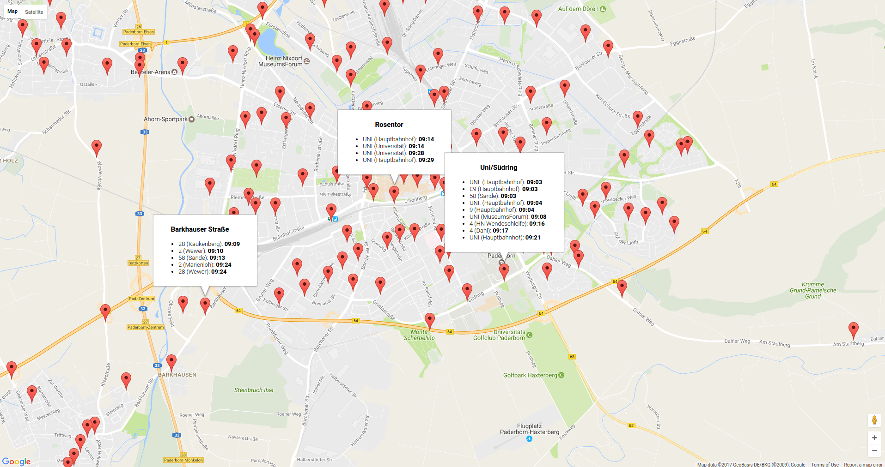

# Displays bus stops in Paderborn with Google Maps markers

On loading the website, it queries the times from all bus stops which takes quite some time.

You have to refresh the site for the times to update.

Check it out at https://gira-x.github.io/paderborn-bus-stops-google-maps

## Notes

* The `bus_stops.json` was created a very long time ago, but I lost the scraping script and don't remember where the data came from
  * The latitude and longitude are not perfectly accurate
* You can set `showBusTimes` in `maps.js` to false, to only display the markers with the bus stop name which loads extremely fast
* The code is very old, and not in its best state

## Screenshots

